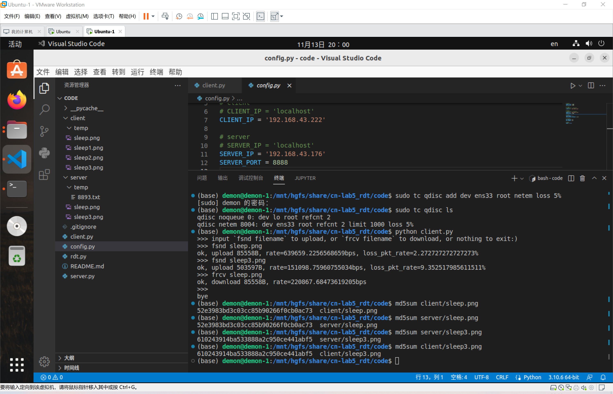
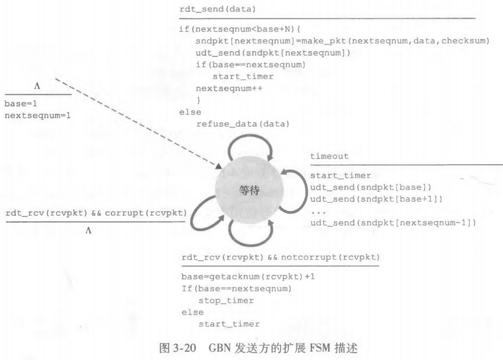
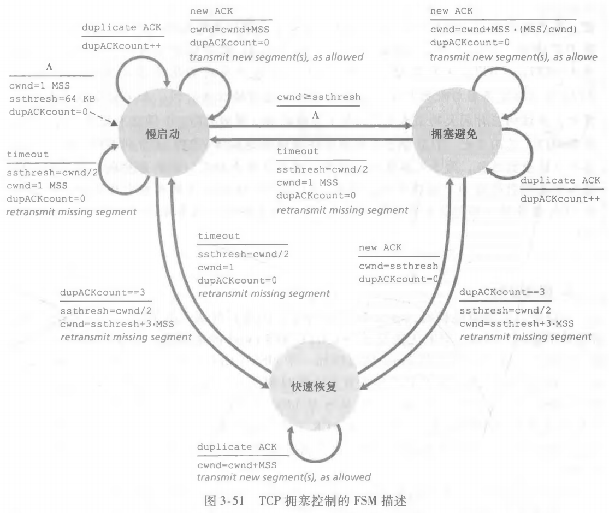
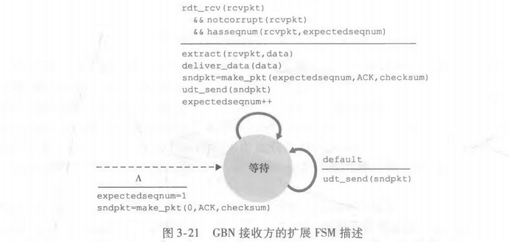

# FDFTP

> 林琰钧 20307130136
>

[TOC]

## 1 设计思路

> 实现了课程内容所讲授的最高级的算法，即TCP与TCP-Reno以及RTT的动态测量

### 1.1 基本要求

1. 基于Python3.6
2. 编写server程序和client程序，client可以通过命令行的命令向server上传下载大文件，server可以同时支持多个client
3. 从课程内容中自选算法解决丢包，超时，乱序等问题
4. 从课程内容中自选算法进行拥塞控制
5. 记录平均上传下载速度，以及丢包率
6. 验证文件完整性

### 1.2 功能实现

1. 基于Python3.6
2. server可以并行连接多个client，client能够通过特定的命令上传或下载大文件
   - 具体见`2 使用手册`
3. 可靠传输采用TCP
   - 握手建立连接
   - 通过ACK确认可靠收到，通过定时器处理超时重传，通过序号解决重复问题，通过窗口与流水线提升性能并妥善处理乱序（方便起见，保留一些GBN的特性，ack表示确认包号，seq表示包号）
   - 握手断开连接
4. 拥塞控制采用TCP-Reno
   - 慢启动（SS）
   - 拥塞控制（CA）
   - 快重传/快恢复（FR/FR）
   - 能够动态估计RTT，并且据此动态设置发送端的超时与窗口
5. 记录平均上传下载速度，以及丢包率
   - 通过传输时的一些信息计算得到
6. 验证文件完整性
   - 命令行通过md5sum验证是否准确传输文件

### 1.3 代码组成

``` plain
config.py: 配置参数
FDFTPsocket.py: 助教提供的测量传输吞吐量与得分的Task类
rdt.py: 可靠传输与拥塞控制的主要实现, 其中有rdt类, 作为Client类和Server类的父类
client.py: 客户端, 其中有Client类，Client类实例化并运行
server.py: 服务器, 其中有Server类及其子类WelcomeServer和ConnectionServer，其两个子类实例化并运行
```

## 2 使用手册

> 使用前必须部署得当，使用时必须按规定操作

### 2.1 部署

#### 2.1.1 文件结构

- 请先创建一个任意名称的文件夹，用来存放代码和文件。以下假设你已经创建好了名为`code`的文件夹，并推荐你使用软件`vscode`打开`code`文件夹

- 如果你同时部署客户端和服务器，需要保证如下项目结构

  ```plain
  |__code
     |__client
        |__temp
     |__server
        |__temp
     client.py
     config.py
     FDFTPsocket.py
     rdt.py
     server.py
  ```

  - 创建`client`文件夹，并在其中创建`temp`文件夹
  - 创建`server`文件夹，并在其中创建`temp`文件夹
  - 把写好的5份python代码放进`code`文件夹
  - 把需要上传的文件放进`client`文件夹
  - 把需要下载的文件放进`server`文件夹

- 如果你只部署客户端，需要保证如下项目结构

  ```plain
  |__code
     |__client
        |__temp
     client.py
     config.py
     FDFTPsocket.py
     rdt.py
  ```

- 如果你只部署服务器，需要保证如下项目结构

  ```plain
  |__code
     |__server
        |__temp
     config.py
     FDFTPsocket.py
     rdt.py
     server.py
  ```

#### 2.1.2 参数配置

- 打开`config.py`文件

- 必做
  - `SERVER_IP`：服务器的IP地址。服务器使用ipconfig或ifconfig得到的IP；客户端使用能ping到服务器的服务器IP
  - `MAX_BANDWIDTH_Mbps `：服务器最大带宽。服务器需要根据服务器状态设置最大带宽（单位：Mbps），以便程序更有效率地运行；客户端不需要设置
- 选做
  - `SERVER_PORT`：服务器欢迎套接字端口号，随意修改，只要不与你电脑在使用的端口号冲突即可
  - `DEBUG`：调试输出，默认为False，你可以将其设为True以查看程序运行的细节
  - `DYNAMIC`：动态RTT测量输出，默认为True，以查看超时与窗口被动态设置为多大
  - `PERFORMANCE`：传输详情输出，默认为True，以查看每次传送了多大的文件、用时、速度、丢包率等信息
- 不建议修改（不当的修改会导致错误！）
  - `DEFAULT_CONG_TIMEOUT`：发送端默认超时重传的时间。服务端的欢迎套接字会采用该值，客户端与连接套接字的超时重传时间会根据建立连接时的延迟测量决定
  - `DEFAULT_CWND`：初始的慢启动阈值，这是根据Google的研究的推荐值设置的，所以设为10.0比较合适
  - `WRITE_MAX`：os的write函数最多一次写入多少个包，这是根据os的write函数的最大负载设置的，计算得到最大为45，所以设为45，大于45会出错！
  - `DEFAULT_RWND`：接收端默认接收端窗口大小，可以设大一些
- 不允许修改
  - `MSS`：每个包的最大负载长度，这是根据UDP负载与我自定义的包结构体设置的
  - `BUFSIZE`：socket的recvfrom的最大接收缓存，这是根据包长度设置的

### 2.2 运行

#### 2.2.1 启动服务器

- 在客户端运行之前，你必须先运行服务器：在`code`文件夹下打开终端输入以下命令启动

  ``` bash
  python server.py
  ```

#### 2.2.2 启动客户端

- 在服务器启动之后，你可以开启任意数量个客户端并行上传或下载文件

- 每个客户端都需要在`code`文件夹下打开终端输入以下命令启动

  ``` bash
  python client.py
  ```

- 如果运行完上述命令输出带有如下字样，说明客户端启动成功，与服务器成功建立连接，你就可以操作客户端

  ``` bash
  > upload  : `fsnd filename`
  > download: `frcv filename`
  > exit    : input nothing:)
  ```

- 如果你发现卡住了，说明3次握手失败（小概率事件，原因会在`2.2.5 异常处理`中阐述），你需要直接关闭该客户端终端并重新执行启动客户端操作

#### 2.2.3 操作客户端

- 上传

  - 如果你想从客户端上传一个文件给服务器，则命令格式是`fsnd filename`。`fsnd`是`file send`的缩写，表示你想从客户端发送文件，`filename`是该文件在`client`文件夹下的相对路径。请注意，你只能上传`client`文件夹中的文件！

  - 比如，你想上传位于文件夹`client`下的文件`filename2.xxx`，请输入如下命令

    ```bash
    fsnd filename2.xxx
    ```

  - 如果该文件不存在，命令行会输出提示，然后客户端退出

  - 等待一段文件上传时间，如果上传成功，命令行会输出提示，然后客户端退出。你会发现文件在`server\filename2.xxx`

- 下载

  - 如果你想从服务器下载一个文件到客户端，则命令格式是`frcv filename`。`frcv`是`file receive`的缩写，表示你想从服务器下载文件，`filename`是该文件在`server`文件夹下的相对路径。请注意，你只能下载`server`文件夹中的文件！

  - 比如，你想下载位于文件夹`server`下的文件`filename3.xxx`，请输入如下命令

    ```bash
    frcv filename3.xxx
    ```

  - 如果该文件不存在，命令行会输出提示，然后客户端退出

  - 等待一段文件下载时间，如果下载成功，命令行会输出提示，然后客户端退出。你会发现文件在`client\filename3.xxx`

- 关闭

  - 如果你想直接关闭客户端，则直接输入回车，就会被解析为请求中断，客户端会向服务器握手中断，然后分别删除文件夹`client/temp`和`server/temp`下相应的缓存文件

#### 2.2.4 关闭服务器

- 最好的做法是，确保客户端都退出后，直接关闭服务器终端即可
- 如果有些客户端还没退出就关闭服务端，会导致缓存文件无法自动清除，你得手动清除（当然不管这些缓存文件也行）

#### 2.2.5 异常处理

- 客户端建立连接

  - 对于3次握手的第1次，客户端向服务器欢迎套接字发送issyn，如果issyn丢包了，即服务器没收到，客户端就会卡住，此时直接终止客户端即可，不影响服务器。
  - 对于3次握手的第2次，服务器欢迎套接字如果收到issyn就会发给客户端issyn，但客户端可能没收到回复的issyn，会卡住，此时直接终止客户端即可，不影响服务器。
  - 对于3次握手的第3次，客户端向服务器连接套接字发送issyn，服务器连接套接字如果收到issyn就会发给客户端issyn，但服务器连接套接字可能没收到issyn，但这不影响，因为客户端马上会上传一个带有延迟和最大接收窗口的文件，保证与服务器连接。

- 客户端断开连接

  客户端进入发终止命令的文件阶段，由于服务器是下载，所以保证能收到并断开连接，但服务器的finack可能丢包，这时候，客户端会一直发fin。因此，在传送终止命令文件前，设置socket的1s超时，这样如果发现客户端一直发重复包，并在1s后停止，说明断开了连接。

- 总之，如果发现客户端卡住，就直接关掉客户端，不会影响服务器

## 3 真实环境测试

> 测试得分可能会随着不同时间不同地点的网络环境而波动，如果网络环境较好会在千分以上

### 3.1 环境

- 一台阿里云服务器，香港节点，2核2G内存，带宽30Mbps
- 自己的电脑

### 3.2 部署

- 在服务器上部署server所需的文件夹及相关内容；配置文件中，`SERVER_IP`设为172.19.6.185，`MAX_BANDWIDTH_Mbps`设为30
- 在自己的电脑上部署client所需的文件夹及相关内容；配置文件中，`SERVER_IP`设为8.210.99.245

### 3.3 测试

- 时间：晚上24点（这时候网络不那么拥塞，测试效果好，如果在网络高峰期测试，score可能会降低）

- 文件：客户端向服务器传送一个约166MB的`cifar-10-python.tar.gz`文件

- 运行：

  

  - 其性能参数提取如下

    ``` plain
    goodput:2257.124853113075Kbps
    score:2205.8490972553327
    size=166502.0224609375Kb
    time=75.53872108459473s
    rate=2204.194353177813Kbps
    pkt_loss_rate=0.5958454066848957%
    ```

  - 由md5sum得知文件传送无误

## 4 算法细节

> 详细的代码注释已经写在了代码文件中，此处描述关键逻辑

### 4.1 类设计


### 4.2 rdt.py

#### 4.2.1 打包与解包

- `make_pkt`：将控制信息与载荷打包

  其中, 包的C语言的结构体定义如下: 

  ``` c
  typedef struct {
      int length; // data的有效长度
      int seq; // 序号
      int ack; // 确认号
      int isfin; // 结束传输(1)
      int issyn; // 握手连接(1)
      int txno; // 事务号, 每上传或下载一次文件就加一
      char[MSS] data; // 负载
  } packet;
  ```

- `extract`：提取包中内容

#### 4.2.2 传输层与应用层、网络层的交互

- `__rdt_send`：辅助函数，发送方应用层将文件内容传递给传输层
- `udt_send`：发送方传输层将包传递给网络层
- `rdt_rcv`：接收方将包从网络层提取到传输层
- `__deliver_data`：辅助函数，接收方将文件内容从传输层传递给应用层

#### 4.2.3 接收文件与传递文件

- `__send_msg_pkt`：辅助函数，发送方不断发送带有文件载荷的包

  - 教材中，GBN发送方的状态转换图如下（不难发现`4.2.1`和`4.2.2`中的函数都是依照该状态转换图设计的）

    

  - 为了升级成TCP，只需做如下改动

    - 发送方每次重传第一个包即可

- `__receive_ack_pkt`：辅助函数，发送方不断接收ack包

  - 教材中，TCP-Reno的状态转换图如下

    

  - 为了实现动态RTT，在`__send_msg_pkt`中每100包触发一次RTT的测量，这里判断如果有重传就忽略此次测量，否则就更新超时时间与RWND。根据指数加权移动平均、BDP公式，关键代码如下：

    ```python
    if self.measure_rtt and self.rtt_target_seq == ack:
        sample_rtt = time.time() - self.rtt_start
        self.estimate_rtt = (1 - 0.125) * self.estimate_rtt + 0.125 * sample_rtt
        self.dev_rtt = (1 - 0.25) * self.dev_rtt + 0.25 * abs(sample_rtt - self.estimate_rtt)
        self.timeout_interval = self.estimate_rtt + 4 * self.dev_rtt
        self.rwnd = math.floor(MAX_BANDWIDTH_Mbps * 1000000 * self.timeout_interval / 8 / MSS)
    ```

- `__receive_msg_pkt_and_send_ack_pkt `：辅助函数，接收方不断接收带有文件载荷的包并发送ack包

  - 教材中，GBN接收的状态转换图如下

    

  - 为了升级成TCP，只需做如下改动

    - 发送方维护一个接收窗口与接收缓存，收到乱序的包就缓存起来，直到缓冲区有从expectedseqnum开始的连续的包时一并上传

- `rdt_upload_file`：发送方发送文件

  - 检查文件是否存在，不存在的话建立一个空文件

  - 初始化一系列控制参数

  - 如果发送指令文件的话就不调用`Task`类，发送具体文件的话就调用`Task`类

  - 开启`__send_msg_pkt`和`__receive_ack_pkt`这两个线程发送文件

  - 如果发送具体文件的话输出性能分

- `rdt_download_file`：接收方下载文件

  - 删除已存在的文件，创建一个用于接收的文件

  - 初始化一些列控制参数

  - 调用`__receive_msg_pkt_and_send_ack_pkt `函数接收文件

  - 如果发现文件为空则删除

#### 4.2.4 关闭文件传输

- `close`：关闭socket并清除缓存文件

### 4.3 client.py

#### 4.3.1 握手连接

- `connect`：与服务器欢迎套接字进行握手并建立于服务器连接套接字的连接
  - client向欢迎套接字发送seq=1,issyn=1
  - server的欢迎套接字分配连接端口号, 并向client返回issyn=1, data=connection_port
  - client向连接套接字发送seq=2, issyn=1，并测量时延、计算拥塞窗口上限并发给服务器，至此建立连接

#### 4.3.2 文件传输

- `rdt_transfer`：根据命令调用`rdt_upload_file`或`rdt_download_file`函数上传或下载文件
  - client每个命令会引发两次的文件传输：
    - 如果client想上传文件, 先发送一个带有用户输入命令的临时文件给server, 然后再发送想上传的文件给server
    - 如果client想下载文件, 先发送一个带有用户输入命令的临时文件给server, 然后从server接收想下载的文件
  - 临时文件的名称为该socket的端口号, client和server的临时文件分别为`client/temp/<client_port>.txt`和`server/temp/<server_port>.txt`

#### 4.3.3 关闭连接

- `shutdown`：于服务器连接套接字握手并关闭连接
  - client会发送一个带有终止命令的临时文件给server让server识别并关闭连接

#### 4.3.4 客户端逻辑

- `main`函数：调用`Client`类的函数

  ``` python
  client_socket = Client()
  try:
      client_socket.connect((SERVER_IP, SERVER_PORT))
      while True:
          line = input('>>> ')
          if line == '':
              client_socket.shutdown()
              break
          cmd = line.split(' ')
          if (len(cmd) != 2) or (cmd[0] != 'fsnd' and cmd[0] != 'frcv'):
              print('wrong cmd')
              continue
          client_socket.rdt_transfer(cmd[0], cmd[1])
          client_socket.shutdown()
          break
  except Exception as e:
      print(str(e))
  client_socket.close()
  ```

### 4.4 server.py

#### 4.4.1 监听连接

- `accept`：服务器欢迎套接字监听是否有客户端需要连接，并分配连接套接字
  - client向欢迎套接字发送seq=1,issyn=1
  - server的欢迎套接字分配连接端口号, 并向client返回issyn=1, data=connection_port，启动连接套接字线程

#### 4.3.2 建立连接

- `connect`：服务器连接套接字与客户端建立连接
  - client向连接套接字发送seq=2, issyn=1
  - 连接套接字接收issyn，并接收带有时延、拥塞窗口上限的文件，至此建立连接

#### 4.3.3 文件传输

- `rdt_transfer`：根据客户端的指令文件调用`rdt_upload_file`或`rdt_download_file`函数上传或下载文件
  - 首先接收client发送的临时文件并解析命令
  - 然后按命令发送或接收文件（client的`rdt_transfer`），或者关闭连接（client的`shutdown`）

#### 4.3.4 连接套接字线程函数

- `communicate `：调用`ConnectionServer`类的函数，服务器连接套接字与客户端交互

  ``` python
  connection_socket = ConnectionServer(connection_port)
  try:
      connection_socket.connect()
      while True:
          connection_socket.rdt_transfer()
  except Exception as e:
      print(str(e))
  connection_socket.close()
  ```

#### 4.3.5 服务端逻辑

- `main`函数：调用`WelcomeServer`类的函数，并伺机启动连接套接字线程

  ```python
  welcome_socket = WelcomeServer(SERVER_PORT)
  try:
      while True:
          connection_port = welcome_socket.accept()
          connection = threading.Thread(target=communicate, args=(connection_port,))
          connection.start()
  except Exception as e:
      print(str(e))
  welcome_socket.close()
  ```

  