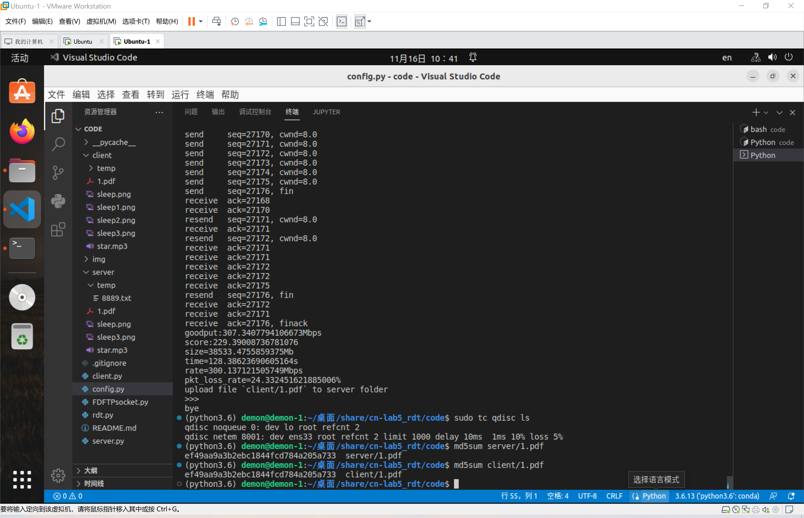
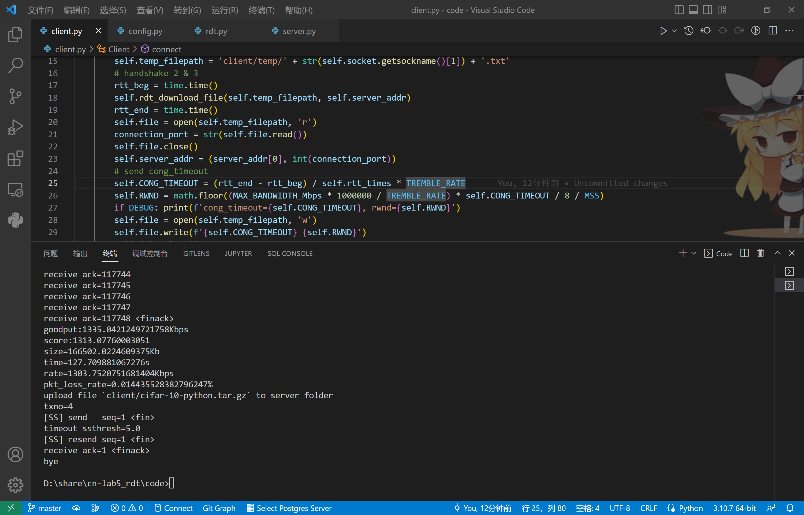

# 1 题目

## 1.1 概述

基于UDP，通过Python的socket库实现可靠的文件传输：FDFTP

## 1.2 基本要求

- 基于Python3.6
- 编写server程序和client程序，client可以通过命令行的命令向server上传和下载大文件，server可以同时支持多个client
- 从课程内容中自选算法解决丢包，超时，乱序等问题
- 从课程内容中自选算法进行拥塞控制验证文件完整性
- 记录平均上传下载速度，以及丢包率

## 1.3 加分项

- 多线程下载同一个文件
- 自己设计的可靠传输和拥塞控制算法
- 选用课程内容以外的算法
- 设计安全机制
- 支持断点续传
- ……
- 以及其他在基本要求之上的功能实现

## 1.4 本地测试

- 用VMware安装两台Ubuntu虚拟机, 并都改为桥接模式
    - 通过ifconfig获得虚拟机各自的IP地址
    - 在配置文件中修改client和server的IP地址
- 客户端利用tc命令模拟丢包, 延迟, 乱序等情况
    - 将网卡延迟设置在10ms, 有10%的可能性±1ms; 添加5%的丢包
      sudo tc qdisc add dev ens33 root netem delay 10ms 1ms 10% loss 5%
    - 查看网络配置
      sudo tc qdisc ls
    - 删除自定义网卡配置
      sudo tc qdisc del dev ens33 root
- 利用md5sum命令比较传输的文件是否准确无误
    - md5sum client/filename
    - md5sum server/filename

## 1.5 真实环境测试

- 部署
  - server在远程服务器上部署(一台阿里云服务器，香港节点，2核2G内存，带宽30Mbps)
  - client在自己的电脑的虚拟机上部署
  - 允许平时登录服务器测试性能
- 配置文件
  - 客户端发服务器，服务器用公网IP: 8.218.117.184
  - 服务器自己，服务器用内网IP: 172.17.50.166
- 终端操作
  - 登录服务器: ssh 20307130136@8.218.117.184
  - 进入自己的目录20307130136/开发

## 1.6 报告

- 设计思路
- 算法细节
- 在模拟环境下的性能测试
- 使用手册……

# 2 第一次迭代（2022.11.11 - 2022.11.13）

## 2.1 功能

- server可以并行连接多个client上传下载文件
- 3次握手建立连接
- GBN流水线可靠传输
- TCP-Tahoe拥塞控制(不带快速重传FR)
- 超时断开连接
- 记录平均上传下载速度，以及丢包率

## 2.2 运行

- 必须先配置好`config.py`中服务器和客户端的端口号
- 首先运行`server.py`, 运行的命令为`python server.py`
- 接下来可以开启多个`client.py`, 每个client运行的命令为`python client.py`
- 在client的命令行可以上传或下载位于指定文件夹下的文件, 示例如下:
  - 上传位于文件夹`client/`下的文件`sleep.png`的命令为`fsnd sleep.png`
  - 下载位于文件夹`server/`下的文件`sleep.png`的命令为`frcv sleep.png`

## 2.3 设计

- 项目结构如下: 

    ``` plain
    |_client: 存储客户端文件
      |_temp: 存储客户端socket的临时文件
        ...
      ...
    |_img: README.md文件中所引用的图片
      ...
    |_server: 存储服务器文件
      |_temp: 存储服务器socket的临时文件
        ...
      ...
    client.py: 客户端, 其中有类Client及其实例化运行
    config.py: 配置参数
    rdt.py: 可靠传输与拥塞控制的主要实现, 其中有类rdt, 作为类Client和类Server的父类
    README.md: 说明文档(本文档)
    server.py: 服务器, 其中有类Server及其实例化运行
    ```

- 连接建立采用3次握手

    - client向server发送seq=1,issyn=1
    - server的欢迎套接字分配连接端口号, 并向client返回issyn=1, data=connection_port
    - client向server发送seq=2, issyn=1, 并建立与connection_port的连接
    - server的欢迎套接字结束3次握手, 之后启动连接套接字线程

- 可靠传输采用流水线GBN

    - 每个client与server的连接都是持续连接, 也就是说一次连接可以串行传输任意数量的文件, 用户输入空字符串则退出, 用户输入`fsnd filename`就可以将文件`client/filename`上传到`server/filename`, 用户输入`frcv filename`就可以将文件`server/filename`下载到`client/filename`, 用户输入其他字符串则要重新输入

    - 发送方将每个文件拆分为一系列负载大小为PACKET_SIZE的包传输, 方便起见, 对于每个文件的传输, seq都是从1开始的, 而且指的是第几个包而不是第几个字节。其中, 包的C语言的结构体定义如下: 

      ``` c
      typedef struct s_packet {
          int length; // data的有效长度
          int seq; // 序号
          int ack; // 确认号
          int isfin; // 结束传输(1)
          int issyn; // 握手连接(1)
          char[MSS] data; // 负载
      } packet;
      ```

    - 实质上, client每个命令会引发两次的文件传输：如果client想上传文件, 先发送一个带有用户输入命令的临时文件给server, 然后再发送想上传的文件给server; 如果client想下载文件, 先发送一个带有用户输入命令的临时文件给server, 然后从server接收想下载的文件。临时文件的名称为该socket的端口号, client和server的临时文件分别为`client/temp/<client_port>.txt`和`server/temp/<server_port>.txt`

    - 如果client尝试传送一个不存在的文件, 则不会与server交换报文, 而是直接请求用户输入下一个命令; 如果client请求server下载一个不存在的文件, server在接收文件名后, 会定时发送fin并等待client的finack

- 拥塞控制采用TCP-Tahoe

    - 发送端维护定时器timer, 拥塞窗口cwnd和阈值ssthresh
    - cwnd的增长分为慢启动SS和拥塞避免CA两个阶段
    - 方便起见, 不支持快重传, 仅每次timeout会将cwnd设为1

- 终止连接采用服务端超时的方法

    - client用户输入一个空的相对路径则关闭客户端套接字, 同时删除临时文件
    - server对连接套接字设置timeout, 捕捉到超时异常则关闭连接套接字, 同时删除临时文件
    - client能够检测到server的timeout, 再次尝试上传或下载文件时, 会关闭客户端套接字, 同时删除临时文件

- 指标记录

    - client记录每个文件的平均上传下载速度, 以及上传的丢包率
    - 由于丢包率只能由发送方测量, 所以client若想得知下载的丢包率, 只需在服务端设置, 由于对称, 所以认为没必要
## 2.4 性能

- 环境
  - sudo tc qdisc add dev ens33 root netem delay 10ms 1ms 10% loss 5%
  - 客户端向服务器传送一个约0.5MB的png文件（传得太慢了，就测这么小……）

- 运行截图

  

- 由md5sum得知文件传送无误, 且其性能参数提取如下

  ```plain
  goodput:5.624198295215536Mbps
  score:3.054778348190921
  ```

## 2.5 TODO

- 升级GBN
- 升级TCP-Tahoe

# 3 第二次迭代（2022.11.14 - 2022.11.17）

## 3.1 v2.1（2022.11.14 - 2022.11.15）

### 3.1.1 功能更新

- 由GBN变为TCP, 但方便起见, 保留一些GBN的特性(ack仍为GBN的ack, seq仍为包号)
- 由TCP-Tahoe变为TCP-Reno, 增加了快速重传/快速恢复机制FR/FR, 利用threading库的Lock解决并发问题
- 导入了助教的Task模块进行性能测试

### 3.1.2 测试

- 环境

  - sudo tc qdisc add dev ens33 root netem delay 10ms 1ms 10% loss 5%
  - 客户端向服务器传送一个约38MB的pdf文件

- 运行截图

  

- 由md5sum得知文件传送无误, 且其性能参数提取如下

  ``` plain
  goodput:85.99851664620239Mbps
  score:78.2454449295223
  ```
- 对比第一次迭代，综合性能提升了20倍左右

## 3.2 v2.2（2022.11.16）

### 3.2.1 功能更新

- TCP-Reno变为TCP-NewReno, 区分partial ack和complete ack,  利用状态机解决细节问题
- 利用服务器欢迎套接字发送带有分配端口号临时文件客户端套接字接收改进握手连接
- 利用欢迎套接字发送带有关闭命令的临时文件服务器连接套接字接收实现握手断联

### 3.1.2 测试

- 环境

  - sudo tc qdisc add dev ens33 root netem delay 10ms 1ms 10% loss 5%
  - 客户端向服务器传送一个约38MB的pdf文件

- 运行截图

  

- 由md5sum得知文件传送无误, 且其性能参数提取如下

  ```plain
  goodput:295.6303614028556Mbps
  score:219.17902256557463
  ```

- 对比第一次迭代，综合性能提升了60倍左右

## 3.3 v2.3（2022.11.17）

### 3.3.1 功能修改

- 发现超时和接收窗口非常影响性能。超时重传过慢会无法及时利用带宽，但过快会造成太多冗余包；窗口过小会无法充分利用带宽，过大的话如果网络拥塞丢失大片包时TCP-NewReno的快速恢复会造成停等性能降低。过去，固定超时重传为1s，窗口大小固定为os.write的写入限制太小，因此现作改进：
  - 初始连接时测量RTT为重传时间`CONG_TIMEOUT`，由于RTT只测量一次，网络可能改变，为了时效性，把客户端改为一次上传或下载一个文件。主流的文件上传下载服务也是这样的。不必模仿TCP的持续传输。毕竟这是FTP。
  - `RWND`改进为设置任意大，不再受os.write写入大小的限制，实质上是分多次写入。
  - `RWND`设置的公式为$RWND=Throughput*RTT$，前者即为服务器最大带宽，后者即为`CONG_TIMEOUT`
- 在包结构中，为每次接收和发送增加事务序列号`txno`
  - 没有`txno`前的问题
    - 发送端发fin，接收端确认finack表示收到文件
    - 如果fin丢了，发送端会超时重传，直到接收端确认，这能保证接收方收到文件
    - 但一旦接收方收到文件，只发送一次finack，不能保证发送方一定收到，这时发送方还会一直传包，而接收方已经到了传下一个文件阶段，可能收到上次的finack直接结束传输
  - 加入`txno`后的改进
    - 每次发送或接收一个文件有一个`tranaction_no`
    - 接收方判断收到的`txno`是否为`tranaction_no`，不是的话说明是上次的上传未收到finack（丢包），因此接收方发送回`txno`的fin，以结束上次的发送方循环
    - 发送方判断收到的`txno`是否为`tranaction_no`，不是的话说明是上次接收方发的`finack`，直接丢掉即可
- 理清了异常状况出现的全部细节
  - 客户端和欢迎套接字的3次握手：对于3次握手的第1次，服务器收到issyn，就会进入3次握手的后2次，向客户端上传一个带有连接端口号的小文件。由于客户端是下载，所以客户端保证能收到，但客户端finack可能丢包，客户端收到了端口号文件，但服务器以为客户端还没收到，就会一直发端口号文件的fin包，进入循环。所以第一次握手不仅要发issyn，还要发isfin，这样下一个客户端尝试连接服务器时，就会结束上一次由于上个客户端finack丢失的服务器欢迎套接字的错误持续重传。如果第1次握手服务器就没收到issyn，不会做任何动作，这时候，客户端会卡住，此时直接终止客户端即可，不影响服务器。
  - 客户端和连接套接字初始连接：客户端会上传一个带有超时重传时间的小文件，服务器保证能收到，但服务器finack可能丢包，服务器接收到了超时文件并准备接收命令文件，但客户端认为服务器还没接收到超时文件，就会一直发超时文件的fin包，就可能被准备接收命令文件的服务器收到，超时信息被误认为是命令，因此这时候服务器要判断文件内容，如果不是命令就主动终止连接，这时候，客户端会一直发fin，此时直接终止客户端即可，不影响服务器。
  - 客户端断开连接：客户端进入发终止命令的文件阶段，由于服务器是下载，所以保证能收到并断开连接，但服务器的finack可能丢包，这时候，客户端会一直发fin，此时直接终止客户端即可，不影响服务器。
  - 总之，如果发现客户端卡住，或一直发重复包，就直接关掉客户端，不会影响服务器

### 3.3.2 测试

- 环境

  - 阿里云服务器
  - 客户端向服务器传送一个约166MB的.tar.gz文件

- 运行截图

  

- 由md5sum得知文件传送无误, 且其性能参数提取如下

  ```plain
  goodput:1335.0421249721758Kbps
  score:1313.07760003051
  ```


## 3.4 TODO

- 写一下算法细节

# 附

## 附1 命令行

python server.py
python client.py

## 附2 上传下载文件命令示例

fsnd 1.mp3
frcv 1.mp3
